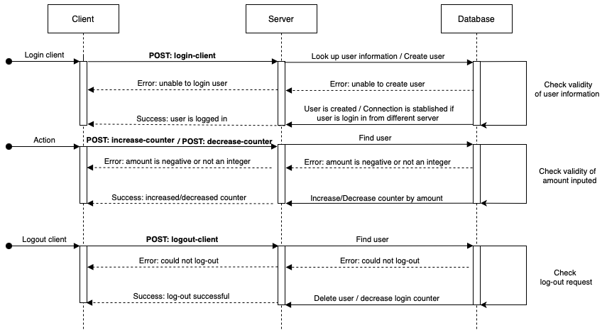

# Computer Security
Eric Banzuzi, Rosamelia Carioni, Chiara Paglioni , Elena Perego,  Giacomo Terragni

## UML Diagram



## Requirements
Python 3 with packages:
- requests
- flask

## 1.Flask
Make sure your terminal is at the same location as app.py. 
Initialize a server by typing:
`flask run`

You should be able to see the following in your  terminal:


## 2. Clients
Put all the json files (data) you  want to read in the folder named **data**.

The clients should be in the following format:

```
{"id": "100",
"password": "eleele",
"server":
{
  "ip": "127.0.0.1",
  "port": "5000"
},
"actions": {
  "delay": "4",
  "steps": [
    "INCREASE 2000",
    "DECREASE 100",
    "DECREASE 100",
    "DECREASE 100",
    "DECREASE 100"
  ]
}
}
```

Open a new terminal in the same location as client.py and read the data by typing:

`python client.py --file "filename"`

## 3.Responses
If everything went well, you should see this in the terminal where the client was read:


The errors for each action are handled separately.
If the client has an invalid value for the amount of **INCREASE** or **DECREASE** inside the actions,
the user will see the errors in the terminal as output. For example, for this client:


You should see the following output:


## 4. Log file
All outputs from the actions executed on the clients counter are stored in a log file in app/logs/logs.txt. 
If you wish to store the data in a different file, change the value of variable **FILENAME** in app.py to the new file's name.

The information is in the following format:
```
ID: 100 | NEW LOG IN | COUNTER: 0
ID: 100 | INCREASE 10 | COUNTER: 10
ID: 100 | DECREASE 1 | COUNTER: 9
```
